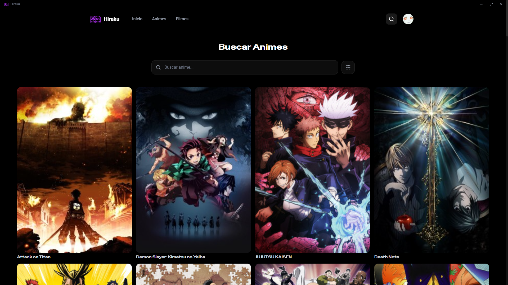

# Hiraku

[Características](#características) • [Download](#download) • [Atalhos](#atalhos-do-player) • [Screenshots](#screenshots) • [Licença](#licença)

---

---

O **Hiraku** é um aplicativo de desktop para assistir animes em português brasileiro. Ele reúne catálogo, informações e trailers do AniList com streaming direto, tudo em uma interface moderna e rápida.

## Índice

1. [Características](#características)
2. [Download](#download)
3. [Atalhos do Player](#atalhos-do-player)
4. [Screenshots](#screenshots)
5. [Créditos](#créditos)
6. [Licença](#licença)

## Características

- **Catálogo completo** — animes e filmes com busca, filtros e temporadas
- **Player integrado** — seleção de qualidade, áudio dublado/legendado e velocidade
- **Progressão automática** — retoma de onde parou e salva histórico
- **Trailers** — assista trailers via YouTube direto nos detalhes
- **Discord Rich Presence** — mostra o que você está assistindo no Discord
- **Atalhos de teclado** — controle total sem usar o mouse

## Download

Escolha a versão para o seu sistema operacional:

### Windows

### Linux

> **Nota:** A versão Linux é experimental.

## Atalhos do Player

| Tecla | Ação |
|-------|------|
| `Espaço` / `K` | Play / Pause |
| `F` | Tela cheia |
| `M` | Mudo |
| `←` / `→` | Retroceder / Avançar 10s |
| `↑` / `↓` | Aumentar / Diminuir volume |
| `Esc` | Fechar player |

## Screenshots

## Créditos

- **[AniList](https://anilist.co/)** — catálogo e metadados de anime
- **[hls.js](https://github.com/video-dev/hls.js/)** — player de vídeo HLS
- **[Electron](https://www.electronjs.org/)** — framework desktop
- **[shadcn/ui](https://ui.shadcn.com/)** — componentes de interface

## Licença

[GNU General Public License v3.0](LICENSE).
