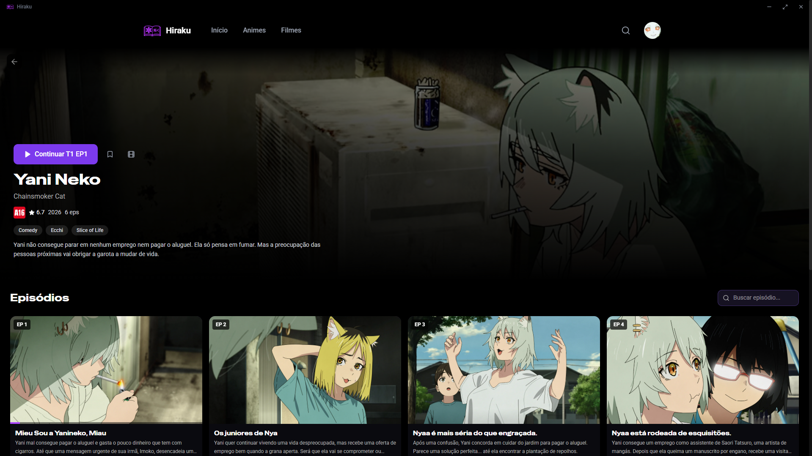

<div align="center">


# Hiraku

**Open Hiraku Project**

[](https://react.dev)
[](https://www.typescriptlang.org)
[](https://tailwindcss.com)
[](https://vitejs.dev)
[](https://www.gnu.org/licenses/gpl-3.0)

</div>

---

## Screenshots

<div align="center">

> Coloque seus screenshots na pasta `docs/screenshots/` e descomente as linhas abaixo.

<!--  -->
<!--  -->
<!--  -->
<!--  -->
<!--  -->

</div>

---

## Funcionalidades

- **Catálogo completo** — 10.000+ animes indexados via AniList
- **Streaming adaptativo** — HLS com qualidade automática via hls.js
- **Player avançado** — controles completos, seleção de qualidade, áudio dublado/legendado
- **Sistema de progressão** — retoma de onde você parou
- **Favoritos** — salve seus animes preferidos
- **Busca inteligente** — por título, gênero, ano e temporada
- **Páginas de filtro** — Animes e Filmes separados
- **Top 10** — ranking estilo Netflix com drag-to-scroll
- **Trailers** — assista trailers do YouTube
- **Classificação indicativa** — indicadores oficiais
- **Discord Rich Presence** — mostra o que você está assistindo
- **Suporte a tela cheia** — fullscreen nativo
- **Atalhos de teclado** — espaço, setas, F, M, K

## Stack Tecnológica

| Tecnologia | Versão | Uso |
|------------|--------|-----|
| React | 19 | UI Framework |
| Vite | 7 | Build Tool |
| TypeScript | 5.6 | Type Safety |
| Tailwind CSS | 4 | Styling |
| hls.js | 1.7 | HLS Streaming |
| wouter | 3 | Routing |
| Express | 4 | Backend Proxy |
| Electron | 44 | Desktop App |
| Lucide React | 0.4 | Icons |
| Discord RPC | 4 | Rich Presence |

## Instalação

### Pré-requisitos

- [Node.js](https://nodejs.org/) 18+
- [pnpm](https://pnpm.io/) 10+

### Passo a passo

```bash
# 1. Clone o repositório
git clone https://github.com/PolarGenericName/Hiraku-Project.git
cd Hiraku-Project

# 2. Instale as dependências
pnpm install

# 3. Inicie em modo de desenvolvimento (navegador)
pnpm dev

# 4. Ou inicie no Electron (desktop)
pnpm electron
```

O app estará disponível em `http://localhost:3000`

### Build para Produção

```bash
# Build do frontend + backend
pnpm build

# Iniciar em produção
pnpm start
```

## Comandos

| Comando | Descrição |
|---------|-----------|
| `pnpm dev` | Inicia server + Vite (dev) |
| `pnpm electron` | Inicia server + Vite + Electron |
| `pnpm build` | Build para produção |
| `pnpm start` | Inicia em produção |
| `pnpm check` | Verifica tipos TypeScript |

## Estrutura do Projeto

```
hiraku/
├── client/                  # Frontend React
│   ├── public/              # Assets estáticos
│   │   └── logo.png         # Logo do app
│   └── src/
│       ├── components/      # Componentes React
│       ├── contexts/        # Context providers
│       ├── hooks/           # Custom hooks
│       ├── lib/             # Utilitários (AniList API, progresso)
│       ├── pages/           # Páginas da aplicação
│       └── providers/       # Providers de streaming
├── server/                  # Backend Express
│   └── index.ts             # Proxy server + APIs
├── electron.cjs             # Processo principal Electron
├── preload.cjs              # Preload script (IPC)
└── docs/                    # Documentação
    ├── TODO.md              # Roadmap
    ├── PROJECT.md           # Documentação detalhada
    └── CHANGELOG.md         # Histórico de versões
```

## Atalhos do Player

| Tecla | Ação |
|-------|------|
| `Espaço` / `K` | Play / Pause |
| `F` | Tela cheia |
| `M` | Mudo |
| `←` / `→` | Retroceder / Avançar 10s |
| `↑` / `↓` | Aumentar / Diminuir volume |
| `Esc` | Fechar player |


## Contribuindo

1. Fork o projeto
2. Crie uma branch (`git checkout -b feature/nova-feature`)
3. Commit suas mudanças (`git commit -m 'Add nova feature'`)
4. Push para a branch (`git push origin feature/nova-feature`)
5. Abra um Pull Request

## Créditos

- **[AniList](https://anilist.co/)**
- **[AnimeFire](https://animefire.plus/)** 
- **[hls.js](https://github.com/video-dev/hls.js/)**
- **[Electron](https://www.electronjs.org/)**
- **[shadcn/ui](https://ui.shadcn.com/)**

## Licença

[GNU General Public License v3.0](LICENSE).


